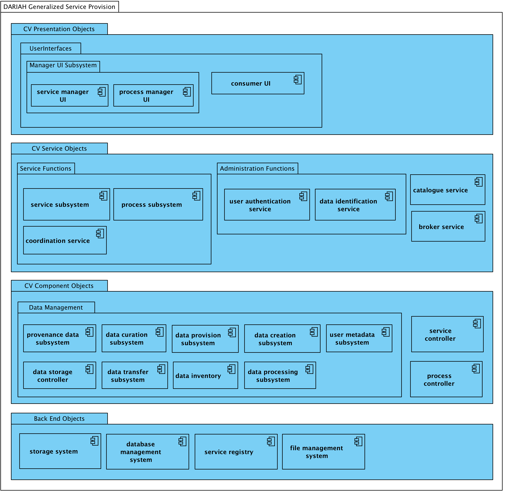
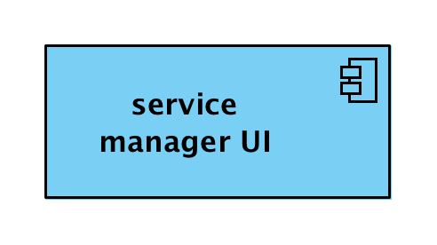
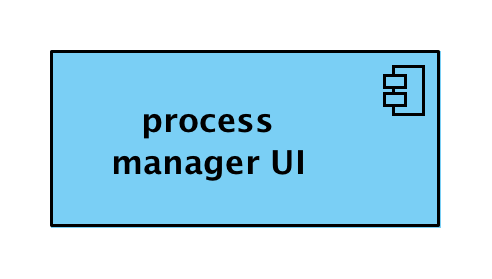

#Services
##DARIAH Service Provision
###Computational Viewpoint
A research Infrastructure (RI) such as DARIAH provides services which facilitate scholars to create, interact, process and store, or deposit, data. Other services maybe provided by the DARIAH community. Here we consider a general form of a service. 

The computational viewpoint (CV) describes the functionality of a system. It decomposes the system into objects encapsulating specific functionality that are implemented by a service or activity. Specific interfaces bind the computational objects together, thus allowing the functionality to be distributed. 

This viewpoint is expressed using an object model in which computational object (CV Object) are abstractions, in this instance, of a research infrastructure’s systems & functions, and the interfaces (CV Interfaces) the computational objects can have, are defined. 

Computational objects can relate to other computational objects in the following ways:

-	**Interaction:** Two objects exchange information as either an operation (request/response), as a (continuous) flow, or as a signal.
-	**Instantiation:** An object creates a new object via instantiation.
-	**Inheritance:** An inherited object has the same interface(s) as its parent object and extends it with additional interface(s).

Specific types of computational objects are used here: 

-	**Binding object:** An object to support more complex interactions between two or more interfaces. These binding objects coordinates this interaction by providing bindings to all required interfaces.
-	**Proxy object:** An object that provides all external interactions of a subsystem and takes care of managing the internal objects of that subsystem.
-	**Controller object:** An abstract object to represent the external interaction with custom objects. It is used to represent specific instruments and processing. 

Research infrastructures, including DARIAH, tend to have a [service-orientated architecture (SOA)](./DARIAH-RA-Glossary.md#g-soa "glossary description of SOA and link") with core functionality encapsulated and accessed via externally facing services and user interfaces which act as brokers.

The CV for a generalised DARIAH service contribution describes set of computational objects that could be expected to constitute a service within the infrastructure. For each of the specific contributing service types a subset of computational objects would normally be expected to be present in the SOA for the functionality of the contribution.

Four groups of computational objects are described below which correspond to architectural layers in a SOA-like structure :

-	**Presentation Objects:** computational objects that provide access to the service by human users (user interfaces)
-	**Service Objects:** computational objects that are service intermediaries that broker and orchestrate the use of the component objects (which may be distributed).
-	**Component Objects:** computational objects that manage and provide access to data
-	**Back End Objects:** computational objects that manage and maintain the data of the service

*DARIAH Generalized Service Provision CV objects*
 
###CV Presentation Objects
CV Presentation objects are the entry points for human users to the services provided.
The user interfaces consist of both service management and researcher (consumer) access points, or gateways.

####Service Manager User Interface
The **Service Manager UI** provides an user interface to access the **Service Subsystem** for authenticated human users with management credentials.  
   

####Process Manager UI
The **Process Manager UI** provides an user interface to access the **Process Subsystem** for authenticated human users with management credentials.  

####Consumer UI
A community portal for interacting with a service, or services, of the distributed infrastructure. 

The **Consumer UI** encapsulates the functions required to interact with the services provided by the research infrastructure externally to the infrastructure. It supports the following interactions:

* *request process (client):* takes input from the researcher to request and start a service.
* *authenticate user (client):* a client interface which requests confirmation of the identity of the user agent. 

This object may take the form of a Virtual Research Environment (VRE), providing a persistent context for a researcher, or group of researchers, service component objects, research data, and interactions between these. Alternatively, it may be an object that facilitates access to a single discreet service.

###CV Service Objects
###Administration Functions
These objects may be internal or external to the RI and services, provided by an external agent such as a national authority.

####User Authentication Service[^1] 
The **User Authentication Service** is a proxy object which confirms the identity of an agent when an agent makes a request to the service (or infrastructure). As part of the (generalised) service provision it is only composed of an authentication service object.
 

The User Authentication Service is a proxy object for all actions needed to verify the identity of an agent. It supports the following interactions:

*	*Authenticate user (server):* is a public interface for determining whether the agent is who it claims to be.
*	*Request user attributes (server):* is a public interface for requesting provided attributes from the agent.

####Data Identification Service[^2] 
The Data Identification Service provides global identification and location functions for research data resources. It is composed of a persistent identification (PID) service object.

 
The Data Identification Service is a proxy object for all actions needed to register, maintain, and retrieve the location of an identified object. It supports the following interactions:

* *Acquire identifier (server):* Public interface for registering new identifiers for data resources and updating the current location.
* *Resolve identifier (server):* Public interface for retrieving the current location of an identified data resource.

####Catalogue Service
The **Catalogue Service** object provides resource discovery functions within the research infrastructure.

 

The **Catalogue Service** is a proxy object, which encapsulates all all the actions needed to allow research resources (data or otherwise) to be discovered. It supports the following interactions:

* *Update Catalogue (server):* is an interface for registering, updating and indexing resources in the catalogue.
* *Query Catalogue (server):* is an interface for querying the catalogue for registered/indexed research resources.
* *Query Resource (client):* retrieves metadata from data stores or other catalogues and sources
* *Export Metadata (server):* provides functionality to gather metadata.

####Broker Service
The **Broker Service** facilitates data access and storage of research data. It facilitates data transfers, query requests, annotation and curatorial services. The broker service validates all requests and verifies the identity and privileges of agents making data requests. 

  

A broker service is a proxy object, which encapsulates all all the actions required to access data. It supports the following interactions:

* *Data request (server):* provides functions for requesting the import or export of datasets, the validation of the request and agent making the request.
* *Annotate data (client):* is used to request annotation of data held within the data curation subsystem.
* *Prepare data transfer (client):* is used to initiate and negotiate data transfers with the data curation subsystem or the data provision subsystem.
* *Query data (client):* is used to forward queries onto the data provision object receive the results.

###Service Functions
CV service functions offer access to distributed systems and resources (internal and external). This allows building of customer (researcher) services using both internal and external sourced components used in the research and data lifecycles.

####Service Subsystem
The **Service Subsystem** provides service functions and is composed of a service subsystem object, a service workbench object and a service controller object. Each request to deploy a service on behalf of an agent, an instance of the service controller object is instantiated by the service workbench. 

 

The **Service Subsystem** is a proxy object for managing the service, input and resulting data in the service. It supports the following interactions:

* *Deploy service (server):* the public interface for the deployment of a new service controller.

The **Service Workbench** is a computational object that instantiates service controller objects. It supports the following interactions:

* *Create service controller (server):* is the interface for requesting a new service controller.
* *New service controller (instantiation):* Instantiation of a new service controller object by the service workbench.

The **Service Controller** is a controller object that runs the service. It supports the following interactions:

* *Configure service (server):* the public interface for configuring and managing the service.
* *Monitor service (server):* is the public interface for monitoring the service.
* *Request process (client):* is used to deploy a process within the service workflow and controller from the **Process Subsystem**.

####Process Subsystem
The Process Subsystem provides access to process functions and is composed of a process subsystem object, a process workbench object and a process controller object. For each request to deploy a process from a service controller, an instance of the process controller object is instantiated by the process workbench. A process can request to deploy a process by which a workflow (chain) or processes can be deployed within a service.

   

The **Process Subsystem** is a proxy object for managing the process, input and resulting data in the service. It supports the following interactions:

* *Deploy process (server):* the public interface for the deployment of a new process controller.

The **Process Workbench** is a computational object that instantiates a new process controller objects. It supports the following interactions:

* *Create process controller (server):* is the interface for requesting a new process controller.
* *New process controller (instantiation):* Instantiation of a new process controller object by the process workbench.

The **Process Controller** is a controller object that runs the process. It supports the following interactions:

* *Configure process (server):* the public interface for configuring and managing the process.
* *Monitor process (server):* is the public interface for monitoring the process.
* *Request process (client):* is used to deploy a process within the service workflow and controller from the process subsystem.

####Coordination Service
The coordination service delegates all servicing and processing tasks, coordinates multi-stage workflows and initiates execution and manages data flow within a service.

  

The coordination service is a proxy object for processing tasks deployed on infrastructure execution resources. It supports the following interactions:

* *Process request (server):* which provides functions for scheduling the execution of process tasks. 
* *Coordinate process (client):* is used to coordinate the execution of data processing tasks on execution resources presented by process controllers. Complex workflows involving many sub-tasks and processes may be orchestrated in this way.
* *Prepare data transfer (client):* This is used if data is required for or generated in a service and is moved into and out of the data store via the data transfer service.

###CV Component Objects

####Data Curation Service 
The Data Curation Service allows data curation by monitoring data and performing transfer, processing and provisioning of the data. The subsystem is composed of a Data Curation Service object.

   

The Data Curation Service provides only one computational function, which is the monitoring of data. When needed, it consumes other subsystems to perform the actual curation. It provides the following interfaces:

* *Monitor data (server):* this is a public interface that allows data to be monitored.
* *Transfer data (client):* this is an interface for transferring data from e.g. data provisioning to data processing.
* *Process data (client):* the interface for processing the monitored data. This may include the calculation of checksums, or the transformation to new data formats.
* *Create data (client):* the interface for the creation of new data. This may include the creation of new metadata.

####Provenance Data Subsystem
The provenance data subsystem is a specialised form of the data curation service which deals with the capture and maintenance of provenance data about the creation, processing, and dissemination of data within a service. [See above](#cvs-dcs "Computational Viewpoint Data Curation Service, Provenance Data Service and User Metadata Service").

####User Metadata Subsystem
The user metadata subsystem is a specialised form of the data curation service which deals with the capture and maintenance of user metadata within a service, for example user and groups privileges within a VRE instance of a VRE service. [See above](#cvs-dcs "Computational Viewpoint Data Curation Service, Provenance Data Service and User Metadata Service").

####Data Provision Subsystem[^3] 
The Data Provision Subsystem provides data sharing, data discovery and data access functions and is composed of a data provision service object, a data inventory service and a data storage controller.

  

The Data Provision Service is a proxy service for the Data Provision Subsystem. It supports the following interactions:

* *Share data (server):* is a public interface for allow data to be shared.
* *Discover data (server):* is a public interface for searching provided data.
* *Access data (server):* is a public interface for accessing provided data.

The **Data Storage Controller** is a controller object that persists the published data. It supports the following interactions:

* *Post data (server):* is an interface for persisting data to the data storage controller.
* *Retrieve data (server):* is an interface for getting data from the storage controller.

The **Data Inventory** is a computational object that allows data to be discovered. It supports the following interactions:

* *Index data (server):* is an interface for registering/indexing data in the inventory .
* *Query inventory (server):* is an interface for querying the inventory for registered/indexed data.

####Data Creation Subsystem[^4] 
The Data Creation Subsystem creates data by recording observations. The subsystem is composed of a data creation service object, a creation instrument workbench object and an creation instrument controller object.

  

The Data Creation Service is a proxy object for managing the instruments and the resulting data. It supports the following interactions:

* *Deploy instrument (server):* is a public interface for the deployment of a new tool.
* *Configure tool (server):* is a public interface for controlling the tool.
* *Provide data (server):* is a public interface for retrieving the created data from the tool.

The **Creation Instrument Workbench** is a computational object that instantiates creation tool controller objects. It supports the following interactions:

* *Create tool controller (server):* is an interface for requesting a new instrument controller.
* *New creation tool controller (instantiation):* an instantiation of a new tool controller object by the creation instrument workbench.

The **Creation Tool Controller** is a controller object that records observations. It supports the following interactions:

* *Configure tool (server):* is an interface for configuration of the tool controller.
* *Get data (server):* is an interface for requesting the data created by the controller.

####Data Processing Subsystem [^5]
The **Data Processing Subsystem** provides data processing functions and is composed of a data processing service object, a data process workbench object and an data process controller object.

  

The Data Processing Service is a proxy object for managing the processing controllers and the data that is (to be) processed. It supports the following interactions:

* *Deploy process (server):* is a public interface for requesting a new process.
* *Get data (client):* is a public interface for retrieving the processed data.
* *Post data (client):* is a public interface for providing data to the process.

The **Data Process Workbench** is a computational object that instantiates data process controller objects. It supports the following interactions:

* *Create data process controller (server):* is an interface for requesting a process controller object.
* *New data process controller (instantiation):* is the instantiation of the new data process controller object.

The **Data Process Controller** is a controller object that processes data. It supports the following interactions:

* *Configure process (server):* the interface for configuring the process.
* *Get data (server):* is the interface for retrieving processed data from the data process controller object.
* *Post data (server):* is the interface for providing data to the data process controller object.

####Data Transfer Subsystem[^6] 
The Data Transfer Subsystem provides transfer services within the service and RI. The subsystem is composed of a Data Transfer Service and an Abstract Data Transfer Object, which may be instantiated as e.g. a Data Importer Object or a Data Exporter Object.

   

The Data Transfer Service is a proxy object for providing data transfers. It supports the following interface:

* *Deploy transfer (server):* is a public interface for requesting a data transfer.
	
The **Abstract Data Transfer Object** is an abstract object that provides the following interfaces.

* *Fetch data (client):* is a client interface for retrieving data from a source.
* *Post data (client):* is a client interface for providing the data to a target.

The example **Data Importer** implements the **Data Transfer Object** for specific environments. In this case, the data importer may specify how the data is fetched from a remote source, whether specific processing needs to take place (via a **Data Processing Subsystem**) and how the outcome should be provided to the target system.

###CV Back End Objects
Back End Objects are objects which encompass the systems and resources provided for preserving, publishing, and processing research data through user accessible services.

####Storage System
The Storage System is a system that manages and stores data and metadata of the research infrastructure.

    

The **File Management System** manages the storage and retrieval of data as files in a computer system.
The **Database Management System** manages the storage and retrieval of data and metadata in logically structured repository systems.

####Service Registry
The service registry is an information system for registering services within the research infrastructure.

	
 
The Service Registry is a proxy object that encapsulates all actions needed to register, update and request service information. It supports the following interactions:

* *Register/update service (server):* is a public interface for registering a service and any maintenance events. 
* *Request service attributes (server):* is a public interface for requesting provided attributes for a registered service.

	
[^1]: From the Reference Architecture for a SSH Infrastructure: https://sites.google.com/a/dans.knaw.nl/reference-model-for-ssh-data-infrastructure/part-2/computational-viewpoint/user-athentication-subsystem
[^2]: From the Reference Architecture for a SSH Infrastructure: https://sites.google.com/a/dans.knaw.nl/reference-model-for-ssh-data-infrastructure/part-2/computational-viewpoint/data-identification-subsystem
[^3]: From the Reference Architecture for a SSH Infrastructure: https://sites.google.com/a/dans.knaw.nl/reference-model-for-ssh-data-infrastructure/part-2/computational-viewpoint/data-provision-subsystem
[^4]: From the Reference Architecture for a SSH Infrastructure:  https://sites.google.com/a/dans.knaw.nl/reference-model-for-ssh-data-infrastructure/part-2/computational-viewpoint/data-creation-subsystem
[^5]: From the Reference Architecture for a SSH Infrastructure:  https://sites.google.com/a/dans.knaw.nl/reference-model-for-ssh-data-infrastructure/part-2/computational-viewpoint/data-processing-subsystem
[^6]: From the Reference Architecture for a SSH Infrastructure: https://sites.google.com/a/dans.knaw.nl/reference-model-for-ssh-data-infrastructure/part-2/computational-viewpoint/data-transfer-subsystem