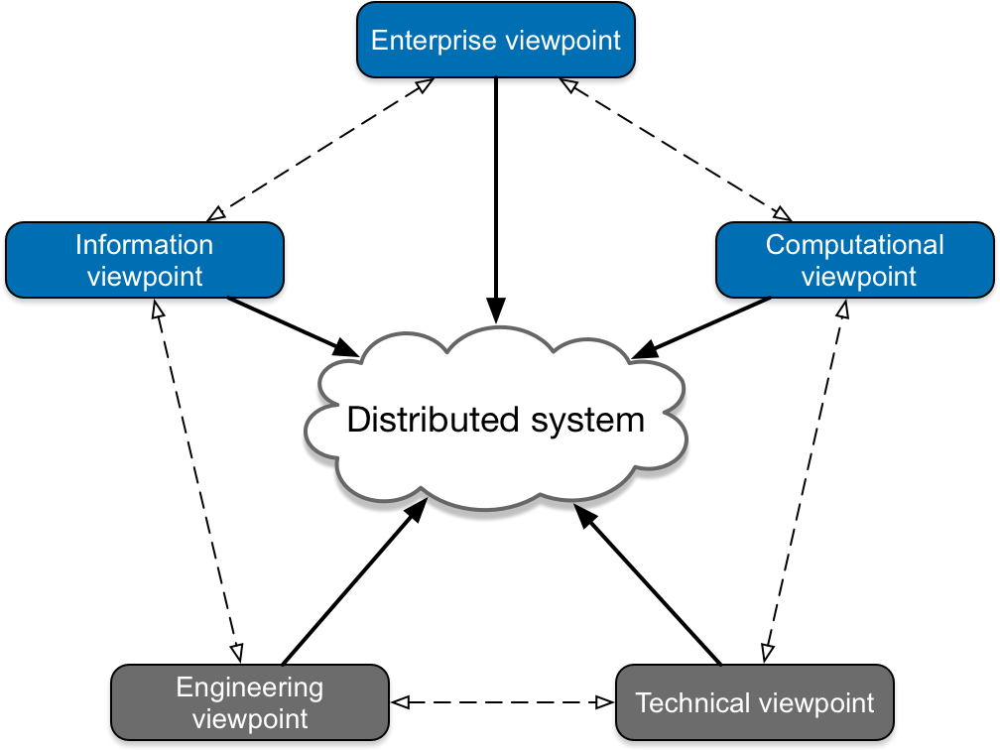
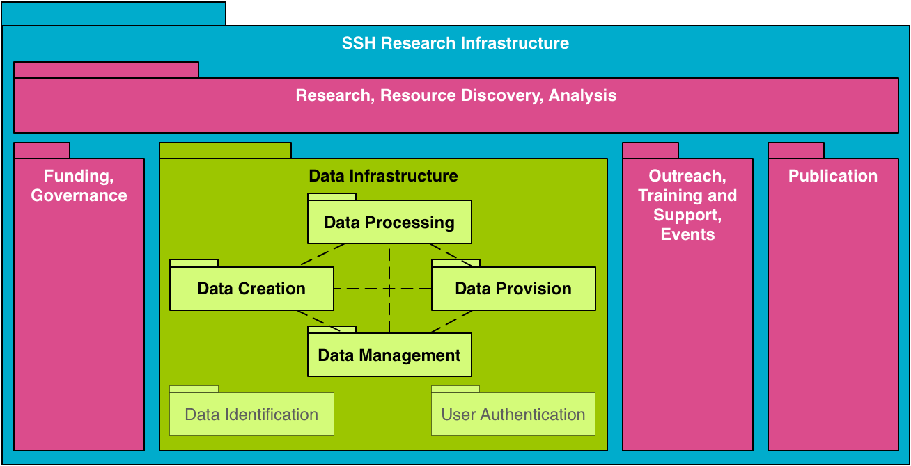

#DARIAH Integrated Service References Architecture
#Introduction
##Why a Reference Architecture for DARIAH-EU? 
The project [Humanities at Scale](http://has.dariah.eu/ "HaS homepage") (HaS) developed a service for the submission of the [in-kind contributions](./DARIAH-RA-Glossary.md#g-ikc "glossary definition for in-kind contributions") for the [DARIAH](./DARIAH-RA-Glossary.md#g-dariah "glossary description of DARIAH and link") [ERIC](./DARIAH-RA-Glossary.md#g-eric "glossary description of an eric and link") member states. 
 
This aim for this [reference architecture (RA)](./DARIAH-RA-Glossary.md#g-ra "glossary description for a reference architecture") is to formally describe in-kind contributions for submission to DARIAH EU. As such, this RA is not an architectual description of the technical elements of a centralised infrastructure, but more of a high-level description of the possible components of a highly-distributed network of services, activities and resources. This reference architecture was developed in parallel with the documentation on the in-kind contributions developed in 2016 to 2017: in fact, it further develops the in-kind definition and components by using a formal language, borrowed from the theoretical models used for distributed ICT systems. More information on what is meant by [infrastructure architectures and a refereance architecture is available](./EHRI-IA-What-is-an-IA.md "EHRI What is Architecture (for Research Infrastructures)"). <!-- Need to sort out URI for this page when a location for the EHRI-IA has been found-->
 
The main goals of such reference architecture are:
 
1.	To communicate and to describe contributions in a common language and to have a common understanding of which components should be described. The in-kind contributions have never been formally described before, including their creation processes. Without the RA, the contributions submission process would, and has, resulted in contributions interpreted and labelled in different ways by each contributing country, thus making the in-kind registry highly heterogeneous and unreliable from an end user perspective.
 
2.	To facilitate the description of the interactions between components of the in-kinds, according to the services or functions they provide. How do the components of the contributions interact? How are they connected? What this reference architecture brings to life is not only a reliable description of the DARIAH contributions, but their description as processes and evolving systems, rather than immovable objects. We think therefore, that it is important to describe these changes and interactions with the environments in which the contributions evolve.
 
3.	To offer an architectural reference for other projects and infrastructures that wish to offer similar services to their (research) communities. 

4.	To mitigate and reduce risk. We consider this reference architecture as a way of reducing the risk mainly derived from point 1: that of interpreting the in-kind contributions in different ways, to describe them without a common reference model. This risk exists not only among partners inside the same research infrastructure, but also for anyone who accesses the DARIAH contributions from other infrastructures. 

##Methodology
In the process of creating a Reference Architecture for the DARIAH in-kind contributions, we were able to count on the support of already existing [reference models](./DARIAH-RA-Glossary.md#g-rm "glossary description of a reference model and link") and reference architectures, both in the fields of ICT, humanities and social sciences.

The models that we used as a reference for our architecture are well known models implemented in the design of ICT processes like the [ODP-RM (Reference Model - Open Distributed Processing)](./DARIAH-RA-Glossary.md#g-odp "glossary description of ODP-RM and link"). 
In addition, a recently developed model as the [RM-SSH (Reference Model for Social Science and Humanities)](./DARIAH-RA-Glossary.md#g-rmssh "glossary description of the RM-SSH and link to website") for data infrastructures developed by the [DASISH project](./DARIAH-RA-Glossary.md#g-dasish "glossary description of DASISH and link to website") provides a more abstract reference model for our work on the DARIAH RA, whose field of action is in the digital arts and humanities. 

###ODP-RM Reference Model 

The [Reference Model of Open Distributed Processing (ODP-RM)](./DARIAH-RA-Glossary.md#g-odp "glossary description of ODP-RM and link") is a reference model in computer science which provides a framework to describe the architecture of open, distributed, processing (ODP) infrastructures; whenever possible ODP-RM uses a formal description techniques for specification of the architecture, in order to guarantee consistency and reliability of such description[^1]. 

This framework is composed of two main approaches:

+ Object modelling: [Object-oriented modelling (OOM)](./DARIAH-RA-Glossary.md#g-oom "glossary description of OOM") is an approach used to model applications and systems by applying the object-oriented paradigm to the entire system. Object modelling usually applies to the modelling of dynamic systems (e.g. business processes) as well as to static structures (components of a system)

+ The description of the system in different viewpoints [(Viewpoint Modelling)](./DARIAH-RA-Glossary.md#g-vpm "glossary description of viewpoint modelling"): it is an effective approach when dealing with complex systems as it represents the subdivision of the specification of a complete system. Despite being relatively independent, the viewpoints are interconnected as some of the key items are identified in other viewpoints. 

 
 *The five viewpoints of ODP-RM* 

####Enterprise Viewpoint (EV) 
This viewpoint allows the focusing on the purpose, scope and policies of a system by describing interrelated communities. These communities are described by community contracts which contain the objectives, roles, policies and behaviour.  For example, the [RM-SSH Data Infrastructure is composed of the following communities](https://sites.google.com/a/dans.knaw.nl/reference-model-for-ssh-data-infrastructure/part-2/enterprise-viewpoint "RM-SSH Data Infrastructure EV Communities")[^2]:

*	[**Data Creation Community**](https://sites.google.com/a/dans.knaw.nl/reference-model-for-ssh-data-infrastructure/part-2/enterprise-viewpoint/data-creation-community "RM-SSH (Reference Model for Social Science and Humanities) Data Creation Community"), who gather data from deployed instruments, 
*	[**Data Management Community**](https://sites.google.com/a/dans.knaw.nl/reference-model-for-ssh-data-infrastructure/part-2/enterprise-viewpoint/data-management-community "RM-SSH (Reference Model for Social Science and Humanities) Data Management Community"), who ingest, administer and curate data, 
*	[**Data Provision Community**](https://sites.google.com/a/dans.knaw.nl/reference-model-for-ssh-data-infrastructure/part-2/enterprise-viewpoint/data-provision-community "RM-SSH (Reference Model for Social Science and Humanities) Data Provision Community"), who provide discovery of, and access to data, 
*	[**Data Processing Community**](https://sites.google.com/a/dans.knaw.nl/reference-model-for-ssh-data-infrastructure/part-2/enterprise-viewpoint/data-processing-community "RM-SSH (Reference Model for Social Science and Humanities) Processing Community"), who generate processed data from deployed processes, 
*	[*Data Identification Community*](https://sites.google.com/a/dans.knaw.nl/reference-model-for-ssh-data-infrastructure/part-2/enterprise-viewpoint/data-identification-community "RM-SSH (Reference Model for Social Science and Humanities) Data Identification Community"), who provide resolution of identifiers for research data,
*	[*User Authentication Community*](https://sites.google.com/a/dans.knaw.nl/reference-model-for-ssh-data-infrastructure/part-2/enterprise-viewpoint/user-authentication-community "RM-SSH (Reference Model for Social Science and Humanities) User Authentication Communit"), who provide federated authentication services for users.

####Information viewpoint: 
The focus of this viewpoint is on the information object without considering representation, implementation or distribution details. The aim of the information viewpoint is to provide a common understanding of the model of the shared information for all stakeholders of the reference model. The information viewpoint is independent from functions that transform and manipulate the data and the computational interfaces. This viewpoint defines a configuration of information objects, their behaviours, actions that can be performed upon the information object and constraints[^3]. Those information objects are: 

*	**Data:** Data information object types can be content objects (observation, concept, and metadata), or container objects (dataset, inventory) grouping similar content object types.
*	**Agents:** Agents are typically human users or machines acting on behalf of human users.
*	**Services:** Services can be human- or automated services and are described by their behaviour or interaction.
*	**Contracts:** Contracts usually exist between two agents, whereas standards exist within a community. They are used to describe agreements between two agents or within a community.

####Computational viewpoint: 
The computational viewpoint describes the functionality of a system. It decomposes the system into objects performing specific functions with specific interfaces. The viewpoint is expressed using an object model which defines the interfaces that objects can have, how these can be bound with other interfaces, the interaction that can take place at these interfaces and the actions that an object can perform (such as creation of new objects, interfaces and bindings)[^4].

*Note:*
Neither the engineering nor the technical viewpoints will be considered in this reference architecture at this point in time. The engineering viewpoint focuses on the mechanisms and functions required to support distributed interactions between objects in the system and therefore, it may be valuable, in the future to consider the engineering viewpoint for some aspects of the architecture.

###DASISH SSH Social Sciences and Humanities Data Infrastructure Reference Model

The DASISH project developed a Reference Model based on the previous observation that there was a lack of understanding of research infrastructures and the relationships between their entities: as Research Infrastructures are distributed infrastructures, they gather numerous stakeholders and have complex organisations. Their structure and functioning is therefore not always clear to an external user. 
In this context, RM-ODP appears to be the most pertinent model to describe them, by providing definition of the core entities and their archetypal distribution.  

*SSH Data Infrastructure Community, its Data Infrastructure Community and other communities*

The RM-SSH concentrated on what was considered as a common element between the five participating SSH infrastructures[^5], and in particular core to DARIAH, CESSDA and CLARIN, and achievable at a  reference model level of abstraction. The DARIAH RA, by its nature dealing with in-kind contributions, covers aspects of a research infrastructure not covered by the RM-SSH concentration on the data infrastructure concerns. Therefore, this RA will hopefully contribute to expanding the RM-SSH.

###Further Development
This reference architecture is the first attempt, and a work-in-progress, to create a reference architecture in the Social Sciences and Humanities research infrastructures. Furthermore, it was the first architecture based upon the RM-SSH reference model. It requires validation against existing and future architectures for services and activities in DARIAH, and elsewhere[^6].
Moreover, it requires further development of the viewpoints, and in particular the computational viewpoint, for DARIAH contribution subtypes. This will aid the understanding of the computational viewpoint with concrete examples of how the described computational objects interact. 
Furthermore, feedback from users of the reference architecture is essential to the further development as well as a governance structure for future releases.

[^1]: Additional examples of use of ODP for humanities infrastructures can be found as [part of the EHRI Information Architecture](./EHRI-IA/EHRI-IA-RM-ODP.md "Describing EHRI Information Architecture in terms of Open Distributed Processing") <!-- sort out link here when sites are up-->
[^2]: <https://sites.google.com/a/dans.knaw.nl/reference-model-for-ssh-data-infrastructure/part-2/enterprise-viewpoint>
[^3]: <https://sites.google.com/a/dans.knaw.nl/reference-model-for-ssh-data-infrastructure/part-2/information-viewpoint>
[^4]: <https://sites.google.com/a/dans.knaw.nl/reference-model-for-ssh-data-infrastructure/part-2/computational-viewpoint>
[^5]: <https://dasish.eu/about_dasish/>
[^6]: Together the RM-SSH, The DARIAH RA and the EHRI Information Architecture (EHRI-IA), span the distributed architectural landscape in the hummanities.