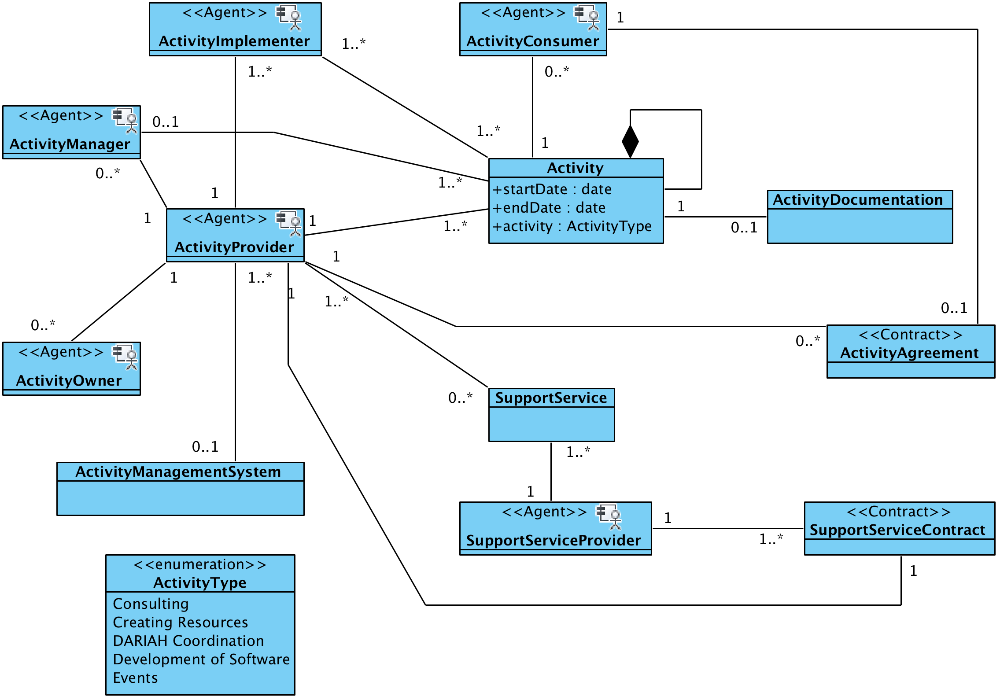

#Activities
##DARIAH Activity Provision
In general terms, an activity can be described as one or a set of actions, performed by an agent (person, machine or institution) in order to achieve a result or product that can be shared and valued by another agent. 

In the context of DARIAH, an activity is interpreted as a collection of people, work items, communications and processes to achieve a specific goal , whose outputs can be made accessible and valued by the DARIAH community (e.g. single researchers as well as research institutions or cultural heritage institutions). 
Differently to the services, an activity is discrete, as it is marked by an agreed beginning and an end. An activity can be part of a service or of a process. 

The examples listed below provide an overview of different activities performed in the DARIAH-ERIC, by displaying different types of data, different communities involved in the creation as well as in the usage/ consumption of the outputs of such activities. 

###Enterprise Viewpoint
The following communities have been identified as being involved in the provision of DARIAH activity [IKC](./DARIAH-RA-Glossary.md#g-ikc "glossary description of in-kind contributions")

-	**Data Creation Community:** The Data Creation Community is involved in the DARIAH activities at different levels and different in-kinds contributions, especially in the “Development of Software” and “Creating resources in-kinds”. This community creates the research data, which in the DARIAH case are represented by digitized cultural objects, as well as training resources. 
-	**Data Management Community:** also in this case, this community is involved in different DARIAH activities, especially in the DARIAH “Consulting” in-kinds. The Data management community has two main aims: on the one hand, it makes sure that the data quality is as high as possible. It also administers and curates the research data. 
-	**Data Provision Community:** It’s involved in the DARIAH activities, especially at the level Consulting and Coordination. The ultimate goal of the DARIAH Coordination is that of making the data and services in DARIAH recognized among the research community. Similarly, as part of the Consulting Activity, the main aim might be that of making the DARIAH resources and activities well known and accessible. 

#### Activity Provision Community Roles 
The following roles are identified in the Activity community

-	**Activity Provision Subsystem (passive role):** the community component representing the activity provision community
-	**Activity Owner (active role):** the agent (individual or institution) who owns, and is ultimately responsibility for, the owned activity.
-	**Activity Provider (active/passive role):** different from the activity implementer, the agent (individual or institution) that performs a certain action in the context of DARIAH.
-	**Activity Implementer (active role):** the agent that executes a certain action on behalf of the activity provider.
-	**Activity Consumer (active role):** the agent (individual/ institution) that receives, consumes or experiences the outputs created during an activity. 
-	**Activity Manager (active role):** has a day to day overview of the running of the activity. This role is also the point of contact for issues with the expected running of the activity
-	**Activity Management System (passive role):** the community component representing the activity management system 
-	**Activity Support (active role):** agent who provides support for the planning and running of an activity. This can be represented by a service (link to service here). 

####Activity Provision Community Behaviours
The following Activity Provision behaviours have been identified:

-	*Activity Management:* the behaviour undertaken by the **Activity Manager**, who overviews the running of the activities on a daily basis. 
-	*Activity Support:* the behaviour of the **Activity Support** agent, offering support for the planning and running of an activity. 
-	*Activity Execution:* the behaviour of a number of agents (**Activity Provider**, **Activity Implementer**) performing certain actions in the context of an activity. 

###Information Viewpoint
The objective of the Information Viewpoint is to provide a common model for generic DARIAH Activities that occur in the infrastructure. It defines a set of IV objects and the set of actions acting upon those objects. The IV specifies the types of Information Objects and their interrelationships.

Platform-specific, or implementation, details are not considered here. The information viewpoint is independent of the Computational Viewpoint interfaces and functions that manipulate the objects, and the technology used to provide the technical infrastructure upon which the objects are stored or transmitted.

####Information Object types 
* *Data*	
	-	*Activity Documentation:* the documentation component of an activity (e.g. procedure, list of documents used for the planning and execution of an activity). 

* *Agent*
An Agent refers to the information object type defined in the RM-SSH . There are a number of agents that may be considered part of the generic DARIAH Activity Provision. 
	-	*Activity Owner:* the agent who owns the activity and its running
	-	*Activity Provider:* the agent who gives instruction to the implementer of an activity
	-	*Activity Implementer:* the agent that executes a certain action on behalf of the activity provider. 
	-	*Activity Consumer:* the agent (individual/ institution) that receives, consumes or experiences the outputs created during an activity. 
	-	*Activity Manager:* has a day to day overview of the running of the activity. This role is also the point of contact for issues with the expected running of the activity
	-	*Activity Management System:* the community component representing the activity management community (e.g. management tools and project officer)
* *Service*	
	-	*Support Service:* series of services that make an event possible (e.g. catering, AV recording)
* *Contract*
	-	*Activity Agreement:* between the activity provider and the activity owner, and the activity consumer. 
	-	*Support Service Contract:* between the activity provider and service provider, that provides a support activity (e.g. catering, venue)

*Activity Information Object Types and Relationships* 

###Computational Viewpoint
The CV for a generalised DARIAH activity contribution describes set of computational objects that could be expected to constitute an activity within the infrastructure. For each of the specific contributing activity types a subset of computational objects would normally be expected to be present in the SOA for the functionality of the contribution.

As per the CV for a generalised service, there are four groups of computational objects as can be seen in figure 7 below.

 
Figure 23: Computational Viewpoint DARIAH General Activity
CV Presentation Objects
Presentation objects are the entry points for human users to the services provided.
The user interfaces consist of both service management and researcher (consumer) access points, or gateways.
Activity Management UI
The Activity Management User Interface provides an user interface to access the Activity Subsystem for authenticated human users with management credentials.

 
Figure 24: Computational Viewpoint Activity Management User Interface object
Support Service UI
The Support Service User Interface provides a user interface to access the Support Services Service for authenticated human users with management credentials.

 
Figure 25: Computational Viewpoint Support Service User Interface
Consumer UI
A community portal for interacting with an activity, or activities, of the distributed infrastructure.
 

The Consumer UI encapsulates the functions required to interact with the activities provided by the research infrastructure externally to the infrastructure. It supports the following interactions:
●	request process (client): takes input from the researcher to request and start a service.
●	authenticate user (client): a client interface which requests confirmation of the identity of the user agent.
CV Service Objects
Administration Functions
These objects may be internal or external to the RI and activities, provided by an external agent such as a national authority.
User Authentication Service 
The User Authentication Service is a proxy object which confirms the identity of an agent when an agent makes a request to the service (or infrastructure) . As part of the (generalised) service provision it is only composed of an authentication service object.
 
Figure 5: Computational Viewpoint User Authentication service object

The User Authentication Service is a proxy object for all actions needed to verify the identity of an agent. It supports the following interactions:
●	Authenticate user (server): is a public interface for determining whether the agent is who it claims to be.
●	Request user attributes (server): is a public interface for requesting provided attributes from the agent.
Activity Subsystem
The Activity Subsystem provides access to activity functions and is composed of an activity service object, an activity workbench object and a activity controller object. For each request to deploy an activity from a service controller, an instance of the activity controller object is instantiated by the activity workbench. 

 
Figure 26: Computational Viewpoint Activity Subsystem

The Activity Service is a proxy object for activity subsystem, managing the activity. It supports the following interactions:
●	deploy activity (server): the public interface for the deployment of a new activity controller.

The Activity Workbench is a computational object that instantiates a new activity controller objects. It supports the following interactions:
●	create activity controller (server): is the interface for requesting a new activity controller.
●	new activity controller (instantiation): Instantiation of a new activity controller object by the activity workbench.

The Activity Controller is a controller object that runs the activity. It supports the following interactions:
●	configure activity (server): the public interface for configuring and managing the activity.
●	monitor activity (server): is the public interface for monitoring the activity.
●	get data (client): is the interface to get data for use in the activity.
●	post data (client): is the interface to receive data created in the activity.
Coordination Service
The coordination service delegates all activity tasks. It coordinates multi-stage workflows and initiates execution and manages any data flow within an activity.
 
Figure 27: Computational Viewpoint Coordination Service object

The coordination service is a proxy object for activity tasks deployed on infrastructure execution resources. It supports the following interactions:
●	process request (server): which provides functions for scheduling the execution of activity tasks. 
●	coordinate process (client): is used to coordinate the execution of activity tasks on execution resources presented by activity controllers. Activity workflows may be orchestrated in this way.
●	prepare data transfer (client): This is used if data is required for or generated in a service and is moved into and out of the data store via the data transfer service.
Support Services Service
The support services service provides access to services provided externally to the research infrastructure and activity. For example, catering services for an event, or software publishing services (e.g. GitHub).

 
Figure 28: Computational Viewpoint Support Services Service object

The support service is a proxy object for support services service for external services. It supports the following interactions:
●	request support service (server): is the interface for initiating a support service for an activity.
●	query support (server): is the interface which provides status information about the support service.
●	get data (client): is the interface to get data for use in the support service.
●	post data (client): is the interface to receive data created in the support service.
CV Component Objects
Storage Controller
Data storage needs for an activity are significantly less complex than potentially for a service, for example, a data hosting and preservation service, thus an activity requires storage controller objects to interface with storage system used by the activity.
 
Figure 29: Computational Viewpoint Storage Controller object
The Storage Controller is a controller object that manages the storage used in an activity. It supports the following interactions:
●	get data (client): is the interface to get data from the storage system.
●	post data (client): is the interface to post data to the storage system.

CV Back End Objects
Back End Objects are objects which encompass the systems and resources provided for preserving, publishing, and processing research data through user accessible services.
Storage System
The Storage System is a system that manages and stores data and metadata of the activity in a research infrastructure.
 
Figure 30: Computational Viewpoint Storage Systems

The File Management System manages the storage and retrieval of data as files in a computer system.
The Database Management System manages the storage and retrieval of data and metadata in logically structured repository systems.
Activity Registry
The activity registry is an information system for registering activities within the research infrastructure.

 
Figure 31: Computational Viewpoint Activity Registry
		
The Activity Registry is a proxy object that encapsulates all actions needed to register, update and request activity information. It supports the following interactions:
	register/update activity (server): is a public interface for registering an activity and any maintenance events. 
	request activity attributes (server): is a public interface for requesting provided attributes for a registered activity.