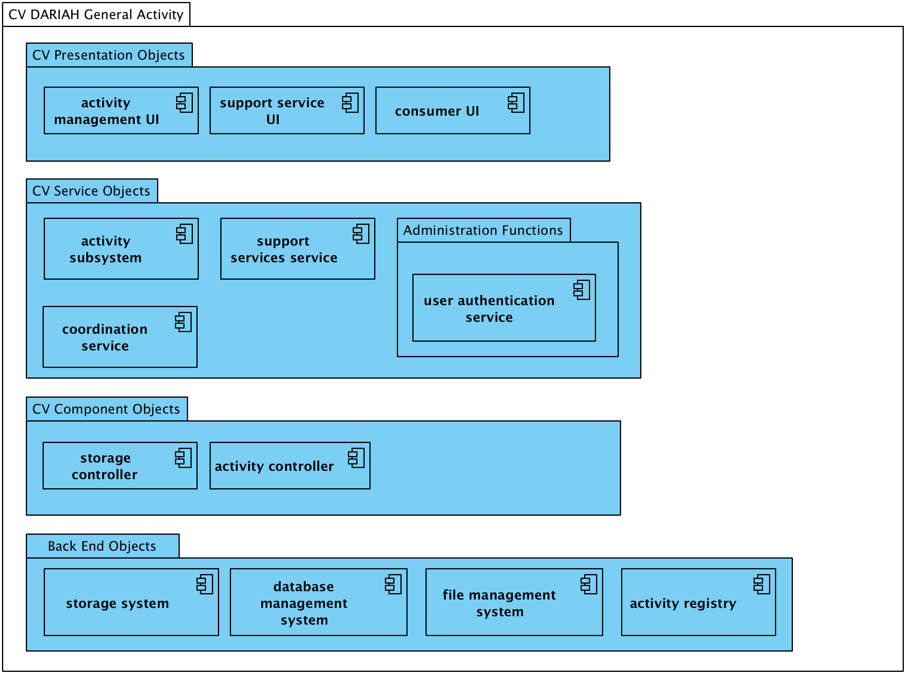
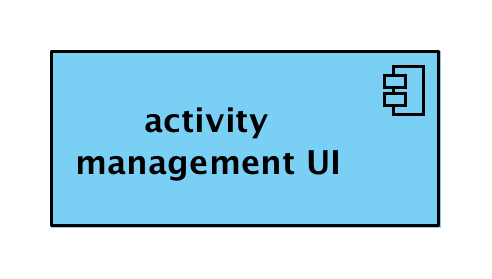
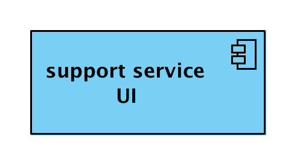

#Activities
##DARIAH Activity Provision
###Computational Viewpoint
The CV for a generalised DARIAH activity contribution describes set of computational objects that could be expected to constitute an activity within the infrastructure. For each of the specific contributing activity types a subset of computational objects would normally be expected to be present in the SOA for the functionality of the contribution.

As per the CV for a generalised service, there are four groups of computational objects.

*Computational Viewpoint DARIAH General Activity*

###CV Presentation Objects
Presentation objects are the entry points for human users to the services provided.
The user interfaces consist of both service management and researcher (consumer) access points, or gateways.

####Activity Management UI
The **Activity Management User Interface** provides an user interface to access the Activity Subsystem for authenticated human users with management credentials.

 

####Support Service UI
The **Support Service User Interface** provides a user interface to access the Support Services Service for authenticated human users with management credentials.

 
 
####Consumer UI
A community portal for interacting with an activity, or activities, of the distributed infrastructure.
 

The **Consumer UI** encapsulates the functions required to interact with the activities provided by the research infrastructure externally to the infrastructure. It supports the following interactions:

*	*request process (client):* takes input from the researcher to request and start a service.
*	*authenticate user (client):* a client interface which requests confirmation of the identity of the user agent.

###CV Service Objects
####Administration Functions
These objects may be internal or external to the RI and activities, provided by an external agent such as a national authority.

####User Authentication Service 
The **User Authentication Service** is a proxy object which confirms the identity of an agent when an agent makes a request to the service (or infrastructure). As part of the (generalised) service provision it is only composed of an authentication service object.

The **User Authentication Service** is a proxy object for all actions needed to verify the identity of an agent. It supports the following interactions:

*	*authenticate user (server):* is a public interface for determining whether the agent is who it claims to be.
*	*request user attributes (server):* is a public interface for requesting provided attributes from the agent.

####Activity Subsystem
The **Activity Subsystem** provides access to activity functions and is composed of an **Activity Service** object, an **Activity Workbench** object and an **Activity Controller** object. For each request to deploy an activity from an Activity Service, an instance of the Activity Controller object is instantiated by the Activity Workbench. 

 

The **Activity Service** is a proxy object for activity subsystem, managing the activity. It supports the following interactions:

*	*deploy activity (server):* the public interface for the deployment of a new activity controller.

The **Activity Workbench** is a computational object that instantiates a new activity controller objects. It supports the following interactions:

* *create activity controller (server):* is the interface for requesting a new activity controller.
* *new activity controller (instantiation):* Instantiation of a new activity controller object by the Activity Workbench.

The **Activity Controller** is a controller object that runs the activity. It supports the following interactions:

* *configure activity (server):* the public interface for configuring and managing the activity.
* *monitor activity (server):* is the public interface for monitoring the activity.
* *get data (client):* is the interface to get data for use in the activity.
* *post data (client):* is the interface to receive data created in the activity.

####Coordination Service
The **Coordination Service** delegates all activity tasks. It coordinates multi-stage workflows and initiates execution and manages any data flow within an activity.

   

The coordination service is a proxy object for activity tasks deployed on infrastructure execution resources. It supports the following interactions:

* *process request (server):* which provides functions for scheduling the execution of activity tasks. 
* *coordinate process (client):* is used to coordinate the execution of activity tasks on execution resources presented by activity controllers. Activity workflows may be orchestrated in this way.
* *prepare data transfer (client):* This is used if data is required for or generated in a service and is moved into and out of the data store via the data transfer service.

####Support Services Service
The **Support Services Service** provides access to services provided externally to the research infrastructure and activity. For example, catering services for an event, or software publishing services (e.g. [GitHub](https://github.com/ "GitHub home page")).

  

The support service is a proxy object for **Support Services Service** for external services. It supports the following interactions:

* *request support service (server):* is the interface for initiating a support service for an activity.
* *query support (server):* is the interface which provides status information about the support service.
* *get data (client):* is the interface to get data for use in the support service.
* *post data (client):* is the interface to receive data created in the support service.
 
###CV Component Objects
####Storage Controller

Data storage needs for an activity are significantly less complex than potentially for a service, such as, a data hosting and preservation service, thus an activity requires storage controller objects to interface with storage system used by the activity.

  
 
The **Storage Controller** is a controller object that manages the storage used in an activity. It supports the following interactions:

* *get data (client):* is the interface to get data from the storage system.
* *post data (client):* is the interface to post data to the storage system.

###CV Back End Objects
Back End Objects are objects which encompass the systems and resources provided for preserving, publishing, and processing research data through user accessible services.

####Storage System
The **Storage System** is a system that manages and stores data and metadata of the activity in a research infrastructure.

  

The **File Management System** manages the storage and retrieval of data as files in a computer system.

The **Database Management System** manages the storage and retrieval of data and metadata in logically structured repository systems.

####Activity Registry
The **Activity Registry** is an information system for registering activities within the research infrastructure.

   
		
The **Activity Registry** is a proxy object that encapsulates all actions needed to register, update and request activity information. It supports the following interactions:

* *register/update activity (server):* is a public interface for registering an activity and any maintenance events. 
* *request activity attributes (server):* is a public interface for requesting provided attributes for a registered activity.