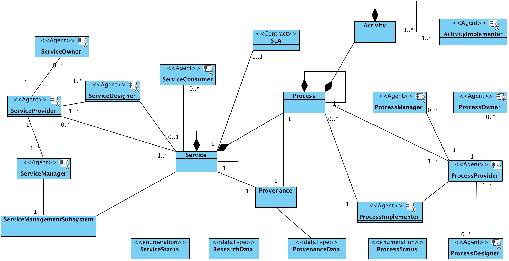

#Services
##DARIAH Service Provision
###Information Viewpoint
In the Information viewpoint the information transmitted between the different stakeholders, in the context of service providing, within the infrastructure, is represented. It is specified by Information Objects and their interrelationships. 

The objective of the Information Viewpoint is to provide a common model for generic DARIAH Activities that occur in the infrastructure. It defines a set of Information Viewpoint objects and the set of actions acting upon those objects. The Information Viewpoint specifies the types of Information Objects and their interrelationships.

Platform-specific, or implementation, details are not considered here. The information viewpoint is independent of the Computational Viewpoint interfaces and functions that manipulate the objects, and the technology used to provide the technical infrastructure upon which the objects are stored or transmitted.
####Information Object types 
#####Data:
*	**Data Object Type** (e.g. Datasets or digitized cultural object): the minimum available information object type that can be shared from an institution with an end user
* **Metadata Object Type:** the information object type that describes and contextualizes the data object type
* **Web applications (Service Object Type)** (e.g. web interfaces, portal, faceted research): the information object type that translates the data object type (in raw format) into a comprehensible information object for the end user. 
* **Transfer Service Object Type** (e.g. API, [OAI-PMH](), [FTP]()): the information object subsystem that makes it possible for the researcher to access the data
* **AAI Response Object** (Object derived from the authentication service)
* **Service Documentation:** the documentation component of a service (e.g. procedure, list of documents used for the planning and execution of a service).

#####Agents: 
Agents are typically human users or machines acting on behalf of human users.
An Agent refers to the information object type defined in the [RM-SSH](./DARIAH-RA-Glossary.md#g-rmssh ""glossary description for the Reference Model for SSH and link"). There are a number of agents that may be considered part of the generic DARIAH Service Provision.

-	**Service Owner:** the agent who owns the service and its running
-	**Service Provider:** the agent who gives instruction to the implementer of a service
-	**Service Implementer:** the agent that executes a certain action on behalf of the service provider.
-	**Service Consumer:** an agent that requests, receives and utilises the service.
-	**Service Designer:** a person who designs, defines, and documents a service based upon the objectives set by the **Service Owner**.
-	**Process Owner:** Has overall responsibility for the process, sets the key objectives, and overall direction, goals, & governance for the process.
-	**Process Designer:** a person who defines, designs and documents a process based upon the objectives of the Process Owner.  
-	**Process Manager**: Coordinates all efforts in the day-to-day running, planning, implementing, monitoring, reviewing and improving the process. The Process Manager is the point of contact for issues with the process and manages incidents or changes to the process.
-	**Process Implementer:** the agent that executes a certain action on behalf of the process owner. 
-	**Activity Implementer:** the agent that executes a certain activity.
-	**Service Management Subsystem:** the system and/or policies used to run a service provision.

#####Services:
Services can be human or automated services and are described by their behaviour or interaction.

-	**AAI (authentication subsystem):** system to authenticate the user in order to access the resources

#####Contracts:
-	**Service Level Agreement:** agreement defining the levels of service and their management between the Service Provider and the Service Consumer.

*Service Information Object Types and Relationships*