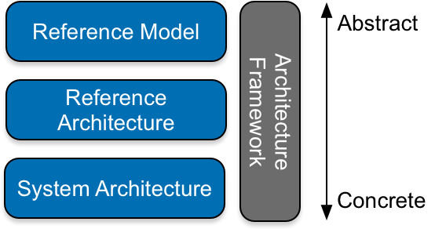

#What is Architecture (for Research Infrastructures)
This section provides a short introduction to the notions of architecture, including definitions for the relevant architectural concepts and explains how they relate to the EHRI information architecture. 

Many will consider all terms like “reference model”, “reference architecture”, “enterprise architecture” or “architecture frameworks” as something architecture-”ish” with diagrams. A good start, but here we need to consider the relationships between these concepts and the EHRI information architecture.

Architecture is an important aspect in the design of systems; from software systems to environments of distributed services and infrastructures, such as EHRI. 

Some examples of architecture standardisation are, amongst others: 

* Systems and software engineering - Architecture description ([ISO/IEC/IEEE 42010:2011](http://www.iso-architecture.org/ieee-1471/index.html "Systems and software engineering — Architecture description - home"))
* Service Orientated Architecture Reference Model ([OASIS SOA-RM](https://docs.oasis-open.org/soa-rm/v1.0/soa-rm.html "Reference Model for Service Oriented Architecture 1.0 - home"))
* Service Orientated Architecture Reference Architecture Foundation ([OASIS SOA-RAF](http://docs.oasis-open.org/soa-rm/soa-ra/v1.0/soa-ra.html "Reference Architecture Foundation for Service Oriented Architecture Version 1.0 - home"))
* Reference Model for Open Distributed Processing ([ODP-RM](https://www.iso.org/standard/55724.html "ISO/IEC 10746-3:2009
Information technology -- Open distributed processing -- Reference model: Architecture")) . 

It is discussed from an enterprise perspective in standards such as The Open Group Architecture Framework ([TOGAF](http://www.opengroup.org/public/arch/p1/oview/index.htm#4 "What is TOGAF?"))  or ArchiMate. Academically it is discussed, for example, by [Cloutier et al](EHRI-IA-Bibliography.md#b-coultier "bibliographic reference"). 

For context of the EHRI information architecture in the architectural development landscape the following definitions are important:

*	**Architecture**: fundamental concepts or properties of a system in its environment embodied in its elements, relationships, and in the principles of its design and evolution.
*	**Architecture Framework**: conventions, principles and practices for the description of architectures established within a specific domain of application and/or community of stakeholders.
*	**Enterprise Architecture**: an architecture in which the system in question is the whole enterprise, especially the business processes, technologies, and information systems of the enterprise.
*	**Reference Architecture**: models the abstract elements in the domain of interest independent of the technologies, protocols, and products that are used to implement a specific solution for the domain.
*	**Reference Model**: an abstract framework for understanding significant relationships among the entities of some environment.

The relations between these concepts with respect to each other, are thus:

* Concrete system architectures are only valid within a specific environment. It contains descriptions of various aspects ranging from high-level principles to low-level technical implementation details of a system within an institution. As such, it is unlikely that any other institution will have the same architecture; 
* An Enterprise Architecture (EA) is an architecture for a specific type of systems, namely an enterprise. As such it typically exceeds a single application and includes, for example, organizational structure, business processes, information systems and infrastructure; 

* A reference architecture (RA) is more generic than an architecture (or EA) and could describe a common architecture for a number of different architectures that are similar, e.g. archives (or museums). It would imply standards that are common for both the archival domain and archives, such as the [ISAD(G)](EHRI-IA-Glossary.md#g-isadg "glossary definition for ISAD(G)") or [EAD](EHRI-IA-Glossary.md#g-ead "glossary definition for EAD"). A reference architecture is an elaboration of a reference model to present a more complete picture that includes showing what is involved in realising the modelled entities;

* A reference model like [OAIS](EHRI-IA-Glossary.md#g-oais "Reference Model for an Open Archival Information Systems")  or [RM-SSH](EHRI-IA-Glossary.md#g-rm-ss "Reference Model for Social Science and Humanities Data Infrastructures")  are even more abstract and discusses only the important entities such as roles, information and functions. Such entities should be valid for most types of archives, digital and non-digital, public, research or governmental, etc. A reference model differs from a reference architecture because it describes the important concepts and relationships in the domain focussing on what distinguishes the elements of the domain, whilst staying independent of any particular solution but instead applies to a class of solutions [(SOA-RAF)](http://docs.oasis-open.org/soa-rm/soa-ra/v1.0/soa-ra.html "Reference Architecture Foundation for Service Oriented Architecture Version 1.0 - home"). 

*Relation between different architectural artefacts in terms of abstraction*

